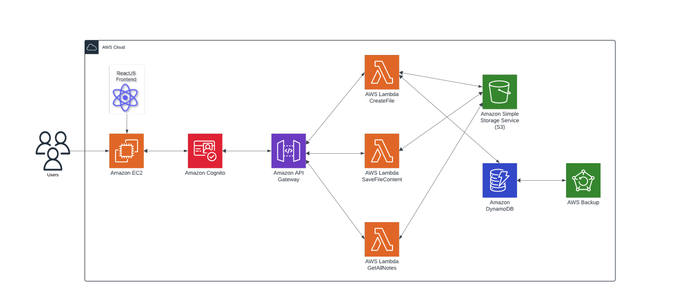

# QuickNotez

## Description

QuickNotez is an innovative personalized note-taking application designed to streamline the process of capturing, organizing, and accessing notes across various devices at any time. Leveraging cloud-based technology, QuickNotez ensures seamless synchronization and accessibility, enabling users to stay productive and organized anytime, anywhere.

## Features
- Store files securely in Amazon S3
- Utilize Amazon DynamoDB for data storage
- Implement backup functionality using AWS Backup
- Authenticate users using AWS Cognito
- Utilize AWS API Gateway for managing APIs
- Execute backend logic using AWS Lambda functions

## Installation

### Prerequisites

- Node.js and npm installed locally.
- AWS account with appropriate permissions set up.
- AWS CLI installed and configured.

### Installation Steps

1. Clone the repository:

   ```bash
   git clone https://github.com/MevawalaBhavya/CSCI-5409-term-project.git
   ```
2. Navigate to the project directory:
    ```bash
    cd note-taking-app
    ```
3. Install dependencies for frontend
    ```
    cd FrontEnd
    npm install
    ```
4. Set up AWS services:
    - Create an Amazon S3 bucket for file storage.
    - Set up a DynamoDB table for data storage.
    - Configure AWS Backup for backup functionality.
    - Set up an AWS Cognito user pool for user authentication.
    - Configure AWS Lambda functions for backend logic.
    - Set up API Gateway for managing APIs.

5. Deploy the built files to your hosting provider.

## Cloud Architecure


## Contributing
Contributions are welcome! Please submit pull requests to contribute to this project.

## Acknowledgements
- [ReactJS](https://reactjs.org/)
- [AWS](https://aws.amazon.com/)
- [Create React App](https://create-react-app.dev/)